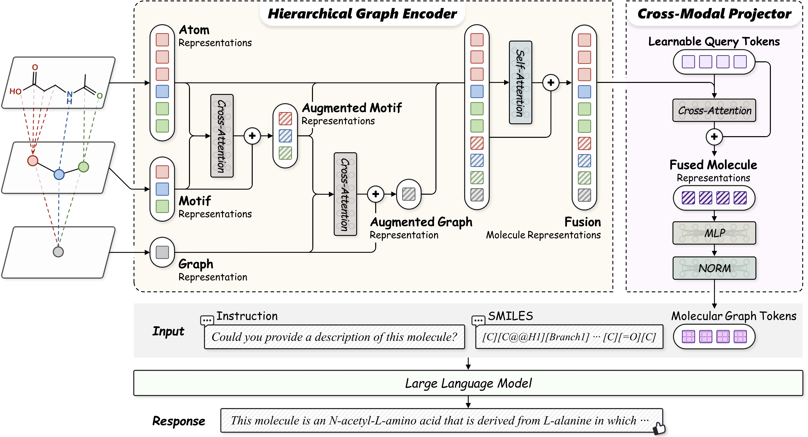

# HQMol: Hierarchical Fusion and Query-Guided Alignment for Molecular Graph-Language Modeling

## OverView
<p align="center">
    <a>  </a>
</p>

## Install
Mostly refer to LLaVA installation
1. Clone this repository and navigate to project folder

2. Install Package
- If you have any trouble install torch-geometric related packages, please refer to [guide-to-pyg-install](https://github.com/chao1224/GraphMVP#environments) for detailed instructions.
```Shell
conda create -n hqmol python=3.10 -y
conda activate hqmol
pip install --upgrade pip
pip install -e .

# Install Graph related packages.
pip install -r requirements.txt
```

## Weights
* TODO

## Dataset
* Pretraining Dataset: Please download the original datasets from [PubChem](https://pubchem.ncbi.nlm.nih.gov/) by following the preprocessing pipeline provided in [MoleculeSTM](https://github.com/chao1224/MoleculeSTM/tree/main/preprocessing/PubChemSTM), then convert the 1D string-based molecule into 2D molecular graphs using the script [pretrain_preprocess.py](../data_preprocess/pretrain_preprocess.py).

* Finetune Datasets: The downstream datasets used for finetuning are provided in the data/ directory.

## Train
### Stage 1: Alignment Pretraining
See [pretrain.sh](scripts/pretrain.sh) for an example of how to run the pretraining stage.
- `$GRAPH_TOWER` can be chosen from `himol` or `moleculestm`.

### Stage 2: Task-specific Instruction Tuning
You can train all specific tasks separately, (e.g., [molecule description generation task](scripts/finetune_lora_molcap.sh)).

## Evaluation
See [scripts/eval](scripts/eval) for detailed instructions on how to evaluate the model.

## Acknowledgement

The code is based on [InstructMol](https://github.com/IDEA-XL/InstructMol/tree/publish) and [Himol](https://github.com/ZangXuan/HiMol).